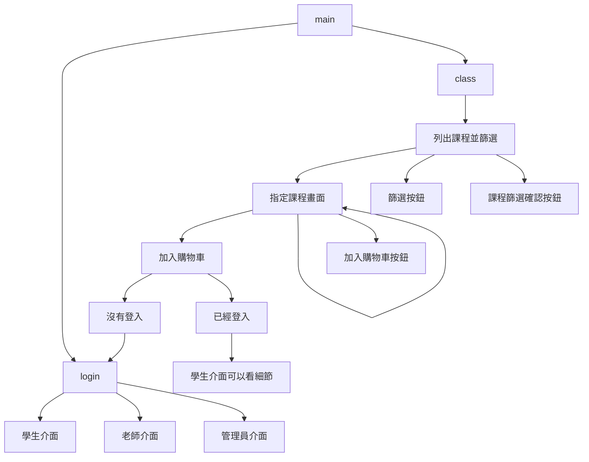
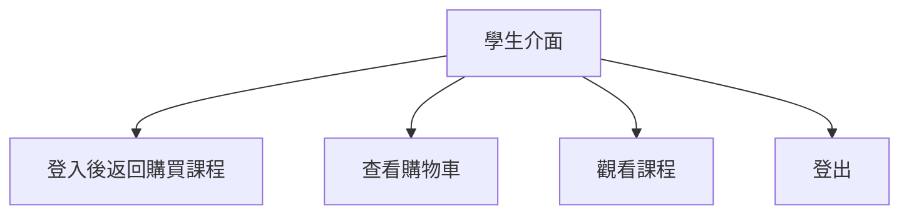
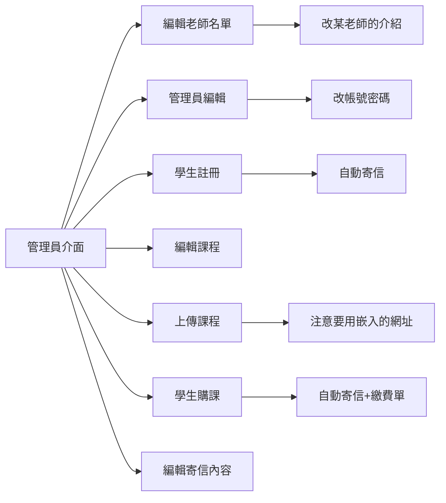
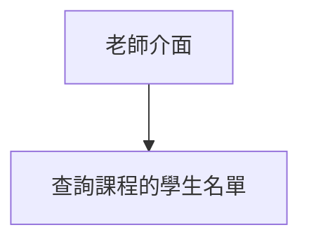

總系統流程

```mermaid
graph TD;

main-->L[login];
main-->C[class];
C-->A[列出課程並篩選]-->B[指定課程畫面]-->加入購物車-->沒有登入-->L
加入購物車-->已經登入-->學生介面可以看細節

L-->學生介面
L-->老師介面
L-->管理員介面

A-->篩選按鈕
A-->課程篩選確認按鈕

B-->
B-->加入購物車按鈕


```
學生介面流程

```mermaid
graph TD;

S[學生介面]-->登入後返回購買課程
S-->查看購物車
S-->觀看課程
S-->登出

```

```mermaid
graph LR;
M[管理員介面]
M-->編輯老師名單-->改某老師的介紹
M-->管理員編輯-->改帳號密碼
M-->學生註冊-->自動寄信
M-->編輯課程
M-->上傳課程-->注意要用嵌入的網址
M-->學生購課-->自動寄信+繳費單
M-->編輯寄信內容

```

```mermaid
graph TD;

T[老師介面]
T-->查詢課程的學生名單


```
