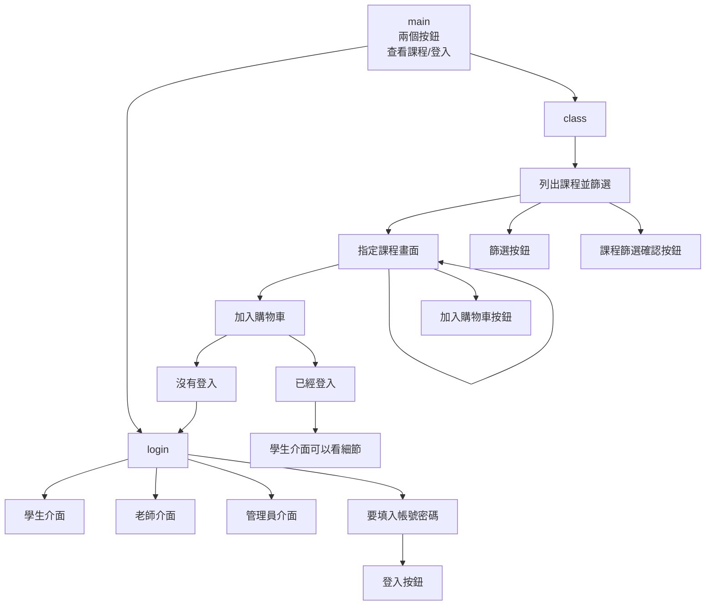
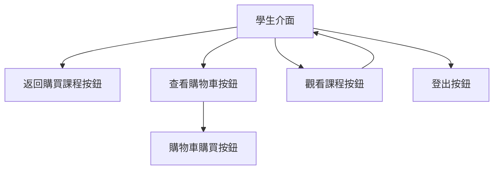
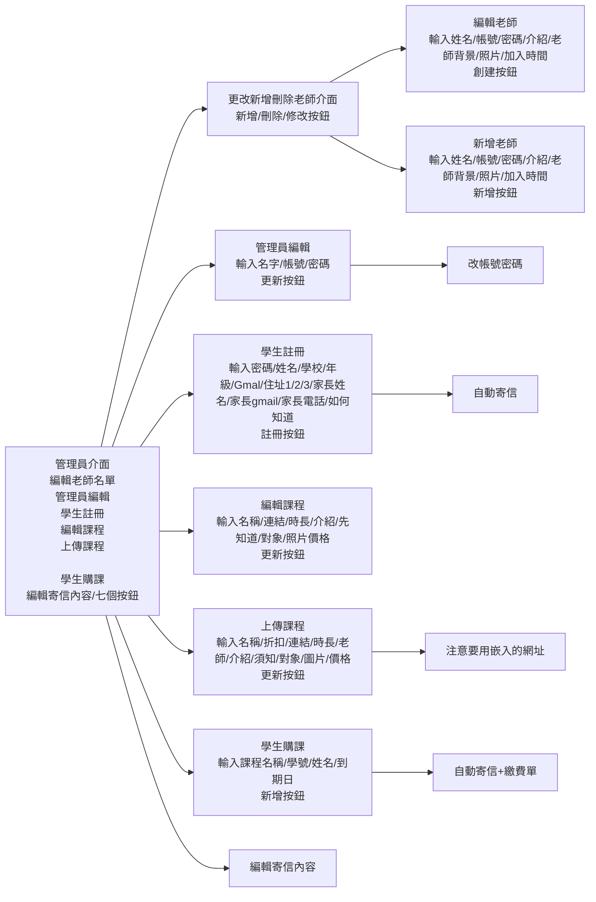
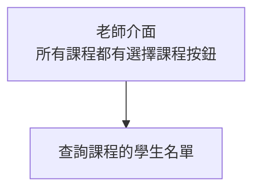

要注意的點
1. 上傳課程要在server上面，先把圖片丟到server再上傳
2. 課程分段是根據_符號，如果只有上傳沒有_的課程就不會在學生的觀看課程裡面看到課程
    例如，上傳"大一微積分"之後，要再上傳"大一微積分_第一段"等等
3. 上傳課程時，要確認這個老師存在，不然會錯誤，因為這個課程要加入到老師的課程表
4. 上傳課程時，折扣連結之間要用'，'分隔
    例如，第一冊全，折扣連結要輸入'課程一，課程二，課程三，........'
5. 加入學生到課程時，記得把學生加入沒有_的就好，例如大一微積分，不要加入到大一微積分_第一段
<<<<<<< HEAD
6. 加入課程的折扣連結，如果沒有的話就不打字
=======
6. 加入課程的折扣連結，如果沒有的話就打NULL
>>>>>>> 0d9ae4934db44b1386542bfdd8de1ff952718947

總系統流程

學生介面流程

管理員流程

老師介面流程

